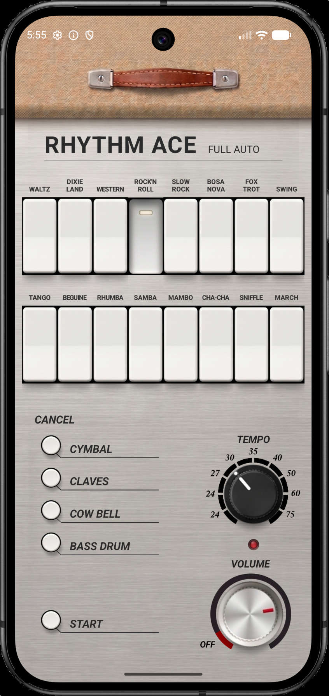

# Ace Tone FR-1 Rhythm Ace Simulator

A faithful simulator of the [Ace Tone FR-1](https://www.vintagesynth.com/misc/fr1.php) (1967), one of the earliest consumer drum machines. All sounds are synthesized — no samples.



## Availability

Now available on the [iOS App Store](https://apps.apple.com/us/app/rhythm-ace/id6763743868). Android users will have to wait a while.

## Features

- **8 synthesized voices** — Bass Drum, Snare, Low Conga, High Conga, Cymbal, Claves, Cowbell, Maracas
- **16 factory presets** — Waltz, Dixieland, Western, Rock'n Roll, Slow Rock, Bosa Nova, Fox Trot, Swing, Tango, Beguine, Rhumba, Samba, Mambo, Cha-Cha, Sniffle, March
- **Pattern combining** — select multiple rhythm buttons to OR their patterns together, just like the original diode matrix
- **Cancel buttons** — mute Bass, Cymbal, Claves, or Cowbell mid-pattern
- **Tempo knob** — 40–240 BPM
- **Volume knob**
- **Downbeat LED**
- Responsive layout — 4-column grid on phones, 8 or 16 columns on tablets

## Stack

- [Expo](https://expo.dev) SDK 55 / React Native 0.83
- [react-native-audio-api](https://github.com/software-mansion/react-native-audio-api) — Web Audio API with native scheduling
- [react-native-reanimated](https://docs.swmansion.com/react-native-reanimated/) + [react-native-gesture-handler](https://docs.swmansion.com/react-native-gesture-handler/) — rotary knobs
- [Zustand](https://github.com/pmndrs/zustand) — state management

## Getting started

```bash
npm install
npx expo prebuild
npx expo run:ios      # or run:android
```

Requires Xcode (iOS) or Android Studio (Android). The `ios/` and `android/` directories are gitignored and generated by `expo prebuild`.

## Voice synthesis

Each voice is a small Web Audio graph — no sample files. Inspired by the FR-1's LC oscillator and transistor-based AR envelope circuitry:

| Voice | Synthesis |
|-------|-----------|
| Bass Drum | Sine, 130→48 Hz pitch sweep, 220 ms exp decay |
| Snare | Triangle + HPF noise burst |
| Low Conga | Sine, 180→120 Hz, 250 ms decay |
| High Conga | Sine, 320→230 Hz, 180 ms decay |
| Cymbal | White noise through HPF 7 kHz |
| Claves | Sine 2.5 kHz, 50 ms decay |
| Cowbell | Two squares (540 + 800 Hz) through BPF |
| Maracas | White noise through BPF 6 kHz, 60 ms decay |

## Pattern accuracy

The 16 preset grids are transcribed by ear from FR-1 demos. The original pattern ROM was never published — treat these as a starting point and refine against reference recordings.
